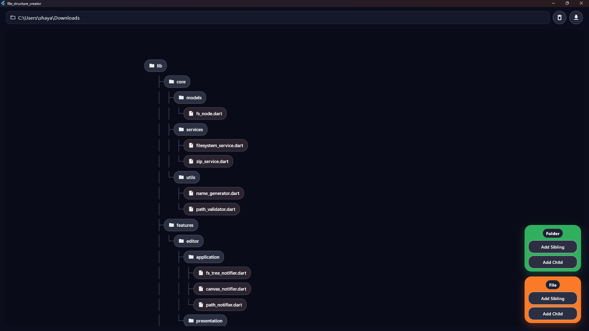

# File Structure Creator
This is a simple and clean app that lets you create complex file structures visually and create it on your desired platform

## INSTRUCTIONS
- Click on a node to select it. By default, a node is always selected
- Use the right panel buttons for adding child or sibling folders and files
- The top bar:
  - Write the desired output location for file structure creation (On Native Platforms)
  - Write the desired zip folder name for download (On Browser Platforms)
  - Use the download button to create/download respectively
  - Use the bin button to delete a node (also deletes it's children)

## DOWNLOAD
- Go to [website](https://shayaandanishansari.github.io/file_structure_visualiser/) for web use
- Go to [releases] to download for your native platform

*For Developers*

## DOWNLOAD AND RUN
- Requirements
  - install git on your native platform
  - install flutter and dependencies
- Clone the repo
  - git clone https://github.com/shayaandanishansari/file_structure_visualiser/ 
- Run
  - flutter run

## CODE STRUCTURE

lib  
|-- src  
|&nbsp;&nbsp;&nbsp;&nbsp;&nbsp;|-- models  
|&nbsp;&nbsp;&nbsp;&nbsp;&nbsp;&nbsp;&nbsp;&nbsp;&nbsp;&nbsp;|-- node.dart  
|&nbsp;&nbsp;&nbsp;&nbsp;&nbsp;|-- services   
|&nbsp;&nbsp;&nbsp;&nbsp;&nbsp;&nbsp;&nbsp;&nbsp;&nbsp;&nbsp;&nbsp;&nbsp;&nbsp;&nbsp;&nbsp;|-- file_export  
|&nbsp;&nbsp;&nbsp;&nbsp;&nbsp;&nbsp;&nbsp;&nbsp;&nbsp;&nbsp;&nbsp;&nbsp;&nbsp;&nbsp;&nbsp;|-- file_export.dart  
|&nbsp;&nbsp;&nbsp;&nbsp;&nbsp;&nbsp;&nbsp;&nbsp;&nbsp;&nbsp;&nbsp;&nbsp;&nbsp;&nbsp;&nbsp;|-- file_export_io.dart  
|&nbsp;&nbsp;&nbsp;&nbsp;&nbsp;&nbsp;&nbsp;&nbsp;&nbsp;&nbsp;&nbsp;&nbsp;&nbsp;&nbsp;&nbsp;|-- file_export_web.dart  
|&nbsp;&nbsp;&nbsp;&nbsp;&nbsp;&nbsp;&nbsp;&nbsp;&nbsp;&nbsp;&nbsp;&nbsp;&nbsp;&nbsp;&nbsp;|-- file_export_unsupported.dart  
|&nbsp;&nbsp;&nbsp;&nbsp;&nbsp;&nbsp;&nbsp;&nbsp;&nbsp;&nbsp;|-- path utils.dart  
|&nbsp;&nbsp;&nbsp;&nbsp;&nbsp;|-- ui   
|&nbsp;&nbsp;&nbsp;&nbsp;&nbsp;&nbsp;&nbsp;&nbsp;&nbsp;&nbsp;|-- tree_app.dart  
|-- main.dart  
